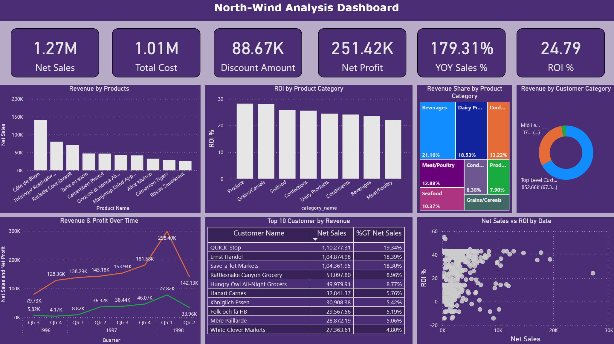

# NorthWind Analytics : From Data to Insights  

Northwind Analytics provides a comprehensive analysis of the Northwind company’s sales and operations data to uncover meaningful business insights. Using data from 11 interconnected areas — including customers, products, orders, suppliers, and employees — this project translates complex information into clear, actionable findings that support smarter decision-making.

The analysis focuses on identifying top-performing products, high-value customers, and key revenue regions, while also revealing opportunities to improve inventory efficiency, employee performance, and overall profitability.

By turning raw data into an easy-to-understand story about business performance, this project enables managers and stakeholders to make informed, evidence-based decisions that strengthen customer relationships, optimize operations, and drive sustainable growth.

# Table of Contents

+ [Project Objective](#project-objective)
+ [Project Files](#project-files)
  - [Data Files](#1-data-files)
  - [SQL Scripts](#2-sql-scripts)
  - [Reports](#3-reports)
+ [Tools and Technologies](#tools-and-technologies)
+ [Setup & Installation](#setup--installation)
+ [Project Workflow](#project-workflow)
  - [Data Preparation](#1-data-preparation)
  - [Analysis & Insights Generation](#2-analysis--insights-generation)
  - [Visualization and Dashboard](#3-visualization-and-dashboard)
  - [Reporting & Documentation](#4-reporting--documentation)
+ [Analysis Summary & Key Insights](#analysis-summary--key-insights)
+ [Project Structure](#project-structure)
+ [Contributing](#contributing)
+ [License](#license)
+ [Author](#author)


# Project Objective

The primary objective of the Northwind SQL Analytics project is to transform business data into meaningful insights that help Northwind’s management make informed, data-driven decisions. The project aims to:

+ Identify key revenue drivers by analyzing top-performing products, customers, and regions.

+ Improve operational efficiency through insights on order patterns, supplier performance, and inventory management.

+ Evaluate employee sales performance to recognize high achievers and identify areas for growth.

+ Understand customer purchasing behavior to support targeted marketing and retention strategies.

+ Provide a data-backed foundation for optimizing profitability, resource allocation, and strategic planning.

By achieving these objectives, the project empowers stakeholders with a clear understanding of how business performance can be enhanced through the intelligent use of data.

# Project Files

Project files are as follows :

## 1. Data Files

The `sql_scripts/` folder contains the original SQL files that form the foundation of this project.  

- `sql_scripts/northwind_ddl.sql` — Defines the complete **database schema** for the Northwind dataset.  
- `sql_scripts/northwind_data.sql` — Contains the **raw data inserts** for all tables such as *Customers*, *Orders*, *Products*, *Suppliers*, *Employees*, and *Shippers*.  

> **Folder path:** `sql_scripts`

### 2. SQL Scripts

The `sql_scripts/` folder contains all SQL-related files used for analysis.  

- `sql_scripts/northwind_analysis.sql` — This is the **main analytical script** of the project.

> **Folder path:** `sql_scripts/`

### 3. Reports

The **`reports/`** folder contains all outputs from the analysis, including dashboards, visualizations, and summary reports.  

- `reports/dashboards/northwind_analysis.pbix` — Power BI dashboard visualizing key metrics and business trends.  
- `reports/figures/` — Image exports of visuals such as revenue trends, ROI charts, and performance comparisons.  
- `reports/summary_reports/northwind_analysis_report.pdf` — Final report summarizing insights, analysis, and recommendations.  

These files provide a complete view of the analytical results and can be used for presentations, business meetings, or further exploration.  

> **Folder path:** `reports/`

# Tools and Technologies

| Category | Tool / Technology | Purpose |
|----------|-----------------|---------|
| Database | PostgreSQL | Host and manage the Northwind dataset; perform SQL queries for analytics |
| Query Language | SQL | Data extraction, aggregation, and analysis |
| Visualization | Power BI | Create dashboards and visualizations of key business metrics |
| Reporting & Documentation | Markdown | Project documentation and README formatting |
| Reporting & Documentation | Quarto | Generate PDF reports and structured summaries |
| Version Control | Git & GitHub | Track project changes, maintain versions, and collaboration |

# Setup & Installation

Follow these steps to set up and run the Northwind SQL Analytics project locally:

### 1. Clone the repository 
   ```bash
   git clone https://github.com/hemant4dsci/northwind_sql_analytics.git

   cd northwind_sql_analytics
   ```
### 2. Install PostgreSQL

+ Ensure PostgreSQL is installed and running on your system.

+ You can download it from https://www.postgresql.org/download/

### 3. Create the Northwind database

+ Open the PostgreSQL client (psql, pgAdmin, or any SQL IDE).

+ Execute the schema file to create tables and load Data:

    - Excute the `sql_scripts/northwind_ddl.sql` to create tables in database.
    - After that excute `sql_scripts/northwind_data.sql` to insert the data in the tables.

### 4. Run the Analysis

+ Execute the main SQL script to generate analytical results:

    - Now execute the main sql script `sql_scripts/northwind_analysis.sql` to start the analysis.


### 5. View reports and dashboards

+ Open the Power BI dashboard: `reports/dashboards/northwind_analysis.pbix`

+ Review the summary PDF report: `reports/summary_reports/northwind_analysis_report.pdf`

Following these steps ensures a fully reproducible setup for exploring, analyzing, and visualizing the Northwind dataset.

# Project Workflow

The project follows a structured workflow to ensure clarity, reproducibility, and efficiency in the analytical process.  

## 1. Data Preparation
- The **Northwind dataset** is recreated and loaded into **PostgreSQL** from raw SQL files located in the `sql_scripts/` directory:

    - `sql_scripts/northwind_ddl.sql` — contains the complete **database schema** (tables, relationships, primary & foreign keys, and constraints).  
    - `sql_scripts/northwind_data.sql` — includes all **data insert statements** to populate tables with realistic business data.

- Once executed, these scripts generate a relational database representing **Northwind Traders**, a fictional company that manages product sales, customer orders, suppliers, and shipping.  
- Key entities and relationships:

    - **Customers ↔ Orders:** Tracks purchasing patterns and order frequency.  
    - **Orders ↔ Employees:** Associates sales transactions with representatives.  
    - **Orders ↔ Shippers:** Links each order with logistics partners.  
    - **Products ↔ Categories / Suppliers:** Captures sourcing and classification data. 

- After database setup, the structure and data integrity were verified by:

    - Checking table relationships and foreign key constraints.  
    - Performing row counts and NULL value checks to ensure data completeness.  
    - Inspecting sample records to validate data accuracy.  

This stage ensured a **clean, normalized, and query-ready relational database** foundation for all further SQL analysis.

## 2. Analysis & Insights Generation
- Conducted initial SQL exploration to understand relationships, keys, and data distributions.  
- Designed and executed **analytical SQL queries** (in `sql_scripts/northwind_analysis.sql`) to answer key business questions, including:
    - Revenue trends over time

    ```sql
    WITH
        quarterly_revenue AS (
            SELECT
                EXTRACT(
                    YEAR
                    FROM
                        odr.order_date
                ) AS order_year,
                EXTRACT(
                    QUARTER
                    FROM
                        odr.order_date
                ) AS order_qtr,
                SUM(
                    odd.unit_price * odd.quantity * (1 - odd.discount)
                ) AS customer_orders
            FROM
                orders odr
                JOIN order_details odd ON (odd.order_id = odr.order_id)
            GROUP BY
                order_year,
                order_qtr
        )
    SELECT
        order_year AS "Order Year",
        order_qtr AS "Order Qtr",
        ROUND(AVG(customer_orders), 2) AS "AVG Qtr Revenue"
    FROM
        quarterly_revenue
    GROUP BY
        order_year,
        order_qtr
    ORDER BY
        order_year,
        order_qtr;
    ```

    | Order Year | Order Qtr | AVG Qtr Revenue |
    |-------------|------------|----------------:|
    | 1996 | 3 | 79,728.57 |
    | 1996 | 4 | 128,355.40 |
    | 1997 | 1 | 138,288.93 |
    | 1997 | 2 | 143,177.05 |
    | 1997 | 3 | 153,937.77 |
    | 1997 | 4 | 181,681.46 |
    | 1998 | 1 | 298,491.55 |
    | 1998 | 2 | 142,132.31 |

    - Top-performing products and categories

    ```sql
    WITH
        revenue_by_product AS (
            SELECT
                prd.product_name,
                ctg.category_name,
                SUM(
                    odd.unit_price * odd.quantity * (1 - odd.discount)
                ) AS total_revenue
            FROM
                public.products prd
                JOIN order_details odd ON (odd.product_id = prd.product_id)
                JOIN categories ctg ON (prd.category_id = ctg.category_id)
            GROUP BY
                prd.product_name,
                ctg.category_name
        )
    SELECT
        product_name AS "Product Name",
        category_name AS "Product Category",
        ROUND(total_revenue, 2) AS "Total Revenue ($)",
        ROUND(
            total_revenue / SUM(total_revenue) OVER () * 100,
            2
        ) AS "Revenue Share (%)"
    FROM
        revenue_by_product
    ORDER BY
        total_revenue DESC;
    ```

    | Product Name             | Product Category  | Total Revenue ($) | Revenue Share (%) |
    |---------------------------|-------------------|------------------:|------------------:|
    | Côte de Blaye             | Beverages         | 141,396.74        | 11.17 |
    | Thüringer Rostbratwurst   | Meat/Poultry      | 80,368.67         | 6.35 |
    | Raclette Courdavault      | Dairy Products    | 71,155.70         | 5.62 |
    | Tarte au sucre            | Confections       | 47,234.97         | 3.73 |
    | Camembert Pierrot         | Dairy Products    | 46,825.48         | 3.70 |
    | Gnocchi di nonna Alice    | Grains/Cereals    | 42,593.06         | 3.36 |
    | Manjimup Dried Apples     | Produce           | 41,819.65         | 3.30 |
    | Alice Mutton              | Meat/Poultry      | 32,698.38         | 2.58 |
    | Carnarvon Tigers          | Seafood           | 29,171.88         | 2.30 |
    | Rössle Sauerkraut         | Produce           | 25,696.64         | 2.03 |

    - Customer segmentation and order frequency 
    ```sql
    WITH
        order_frequency AS (
            SELECT
                cst.company_name AS customer_name,
                odr.order_date,
                COALESCE(
                    odr.order_date - LAG(odr.order_date) OVER (
                        PARTITION BY
                            cst.company_name
                        ORDER BY
                            odr.order_date
                    ),
                    0
                ) AS days_frequency
            FROM
                orders odr
                JOIN customers cst ON odr.customer_id = cst.customer_id
        )
    SELECT
        customer_name AS "Customer Name",
        ROUND(AVG(days_frequency), 2) AS "AVG Order Day Frequency"
    FROM
        order_frequency
    GROUP BY
        customer_name
    ORDER BY
        "AVG Order Day Frequency" DESC
    LIMIT
        10;
    ```
    | Customer Name                        | AVG Order Day Frequency |
    |--------------------------------------|-------------------------:|
    | GROSELLA-Restaurante                 | 253.00 |
    | Bólido Comidas preparadas            | 176.67 |
    | The Big Cheese                       | 139.50 |
    | Ana Trujillo Emparedados y helados   | 133.00 |
    | Du monde entier                      | 128.50 |
    | North/South                          | 123.33 |
    | Romero y tomillo                     | 120.60 |
    | Comércio Mineiro                     | 120.60 |
    | Consolidated Holdings                | 117.67 |
    | Morgenstern Gesundkost               | 116.00 |

    - Employee sales performance and regional contribution
    ```sql
    WITH
        employee_revenue AS (
            SELECT
                odr.employee_id,
                CONCAT(emp.first_name, ' ', emp.last_name) AS employee_name,
                rgn.region_description AS regions,
                ROUND(
                    SUM(
                        odd.unit_price * odd.quantity * (1 - odd.discount)
                    ),
                    2
                ) AS net_revenue
            FROM
                order_details odd
                JOIN orders odr ON odr.order_id = odd.order_id
                JOIN employees emp ON odr.employee_id = emp.employee_id
                JOIN employee_territories etr ON etr.employee_id = emp.employee_id
                JOIN territories trt ON trt.territory_id = etr.territory_id
                JOIN region rgn ON rgn.region_id = trt.region_id
            WHERE
                emp.title = 'Sales Representative'
            GROUP BY
                odr.employee_id,
                employee_name,
                regions
        )
    SELECT
        employee_name AS "Employee Name",
        regions AS "Regions",
        net_revenue AS "Net Revenue ($)",
        ROUND((net_revenue / SUM(net_revenue) OVER () * 100), 2) AS "Revenue Share (%)"
    FROM
        employee_revenue
    ORDER BY
        net_revenue DESC,
        regions;

    ```
    | Employee Name     | Regions  | Net Revenue ($) | Revenue Share (%) |
    |-------------------|----------|----------------:|------------------:|
    | Robert King       | Western  | 1,245,682.35    | 30.75 |
    | Janet Leverling   | Southern | 811,251.37      | 20.03 |
    | Margaret Peacock  | Eastern  | 698,672.54      | 17.25 |
    | Anne Dodsworth    | Northern | 541,156.47      | 13.36 |
    | Nancy Davolio     | Eastern  | 384,215.21      | 9.49 |
    | Michael Suyama    | Western  | 369,565.65      | 9.12 |

- Derived key metrics, KPIs, and insights to support data-driven decision-making.

## 3. Visualization and Dashboard
- Built an interactive **Power BI dashboard** (`reports/dashboards/northwind_analysis.pbix`) to visualize insights such as:  
    - Revenue by product and category  
    - ROI distribution  
    - Time-based sales trends 
    
- Exported static visualizations (e.g., `revenue_by_product.png`, `roi_by_product_category.png`) for quick documentation.

## 4. Reporting & Documentation
- Compiled analytical findings, visuals, and recommendations into a **summary report** (`reports/summary_reports/northwind_analysis_report.pdf`).  
- Documented the complete workflow and insights within the **README** for reproducibility and reference.

---

> This structured workflow ensures a transparent, modular, and reproducible analytics process — from database setup to business insights and reporting.


# Analysis Summary & Key Insights

+ Revenue Concentration: A few categories — particularly Beverages, Dairy Products, and Confections — contribute the majority of total revenue, indicating a concentrated sales portfolio.

+ Customer Retention Strength: Repeat customers account for over 90% of total revenue, demonstrating strong loyalty and sustained engagement from the existing client base.

+ Regional Dominance: The USA and Germany lead overall sales, while markets like Austria and Brazil are showing promising upward trends for future expansion.

+ Cross-Selling Opportunities: Frequently paired items (e.g., Gorgonzola Telino and Pavlova) reveal potential for bundling strategies to increase order value.

+ Operational Efficiency in Shipping: United Package provides the best cost-to-delivery ratio, suggesting a reliable and cost-efficient logistics partner compared to alternatives.

+ Seasonal Demand Trends: Clear peaks in Q4 1997 and Q1 1998 highlight predictable seasonal buying patterns that can guide production and marketing efforts.

+ Category Profitability Insights: Produce and Grains/Cereals deliver the highest ROI (~28%), proving that even lower-cost categories can yield strong profitability when efficiently managed.

## Project Structure
```bash
northwind_sql_analytics/
├─ data/                              # Contains all project data files
│  ├─ final/                          # Final processed data
│  ├─ interim/                        # Intermediate or temporary datasets
│  └─ raw/                            # Original raw SQL files for database setup
│
├─ logs/                              # Logs of script executions or errors
│
├─ notebooks/                         # Exploratory analysis or walkthrough notebooks
│
├─ reports/                           # All project outputs, visuals, and reports
│  ├─ dashboards/                     # Interactive Power BI dashboard files
│  │  └─ northwind_analysis.pbix
│  ├─ figures/                        # Exported static charts and visuals
│  │  ├─ northwind_dashboard.png
│  │  ├─ revenue_by_product.png
│  │  ├─ revenue_over_time.png
│  │  └─ roi_by_product_category.png
│  └─ summary_reports/                # Final analytical and summary reports
│     └─ northwind_analysis_report.pdf
│
├─ scripts/                           # Python scripts for automation, preprocessing, or ETL tasks
│
├─ sql_scripts/                       # SQL queries for analysis
│  ├─ northwind_data.sql
│  ├─ northwind_ddl.sql
│  └─ northwind_analysis.sql
│
├─ .gitignore                         # Git configuration to exclude unnecessary files
├─ LICENCE                            # License information for open-source use
└─ README.md                          # Project documentation
```

# Contributing

Contributions are welcome! Please fork the repository and submit a pull request.


# License

This project is licensed under the MIT License.


# Author

Hi, I'm Hemant, a data enthusiast passionate about turning raw data into meaningful business insights.

**Let’s connect:**
- LinkedIn : [LinkedIn Profile](https://www.linkedin.com/in/hemant1491/)  
- Email : hemant4dsci@gmail.com
